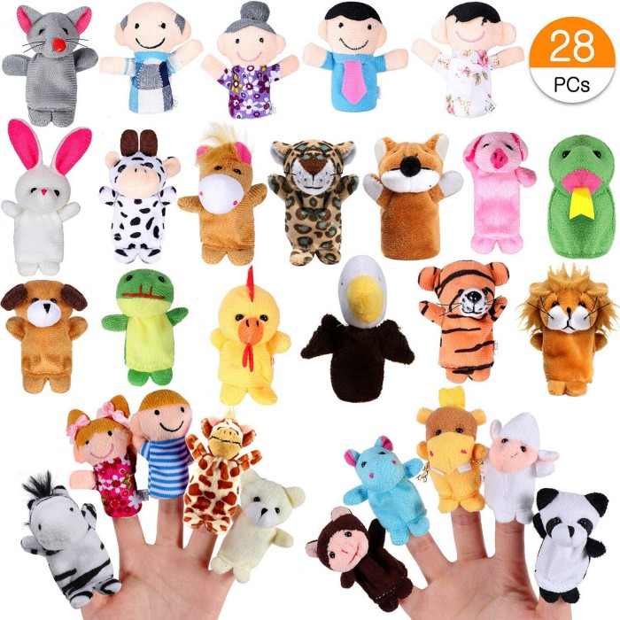
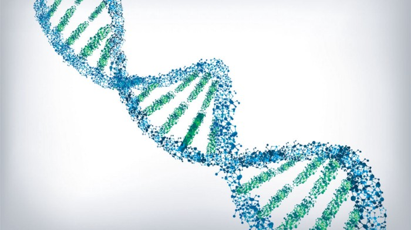
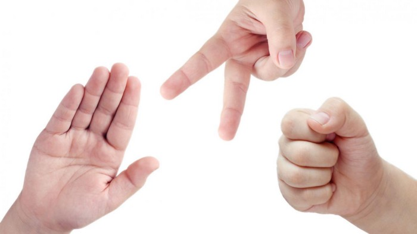
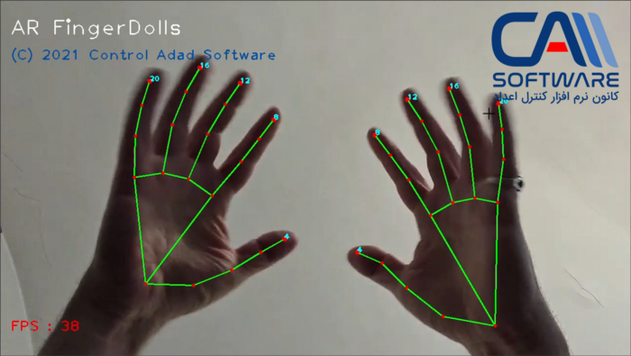
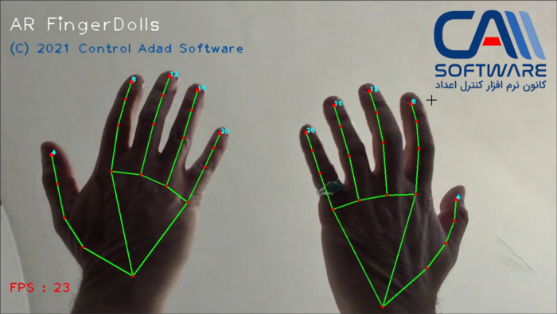

Early human had children, so invented toys to amuse their kids, so they have enough time and freedom to invent other things!
This story was not ended there, and it’s a never-ending one. Humans have children that grow and become parents who have new children who need toys.
#Old toys are not amusing anymore
God made the human in form of a super complex neural network. Which of course learns, updates, and grows. Human’s kids, which are neural networks too, are improved in generations and carried updated neural data via a life-form storage, called DNAs.

A new method of storing data in the nucleotide bases of DNA is the highest-density storage scheme ever invented. NOVI ELISA/SHUTTERSTOCK
#DNAs are life-form multi-petabytes storage devices.
DNAs are life-form storage devices, carrying lots of data, including natural neural network experiences (weights).
“Now, researchers report that they’ve come up with a new way to encode digital data in DNA to create the highest-density large-scale data storage scheme ever invented. Capable of storing 215 petabytes (215 million gigabytes) in a single gram of DNA,” (source: https://www.sciencemag.org/news/2017/03/dna-could-store-all-worlds-data-one-room)

(https://www.sciencemag.org/news/2015/05/rock-paper-scissors-may-explain-evolutionary-games-nature)

#Rock, Paper, and Scissors is an old-fashioned game.
Today, Aprile 22nd, 2021, children are not interested in rock, paper, and scissors, anymore, it’s natural. Their brains are carrying tons of data and they are born as sort of tiny Einsteins, but hopefully, they can’t talk initially. But they grow fast and ask for more and more complex and hard-to-solve games. Their solving powers (Natural Neural Engine Machines) are improved by generations, their memories are used for more useful data, but not to remember how to multiply or how to divide numbers!

MediaPipe, by Google

#At last, AR (augmented reality) finger dolls, using Google’s MediaPipe
Last week, while I was surfing the web for the latest ML and DL news and libraries, I found MediaPipe, a super fun library developed by Google (https://github.com/google/mediapipe).
I was just wondering what funny and amusing thing I can do to test MediaPipe? While trying to create something new, less boring than basic image classification, I faced upon a finger doll saying hello to me, so I made an AR version of it!
The first step was to install OpenCV and MediaPipe, then used MediaPipe’s hand recognition engine, then I wrote a dozen lines of code, it was amazing, it can read my hands!

MediaPipe easily detects key points of my hand!

It can detect my hands from any angle.

The next step is fitting dolls along the tip of the finger and the top knuckle. Piece of cake, we have both key points, so we can multiply each doll by a rotation matrix and then stick it to the finger:

And TADA! finally the video of hand detection and Finger Doll installation!

